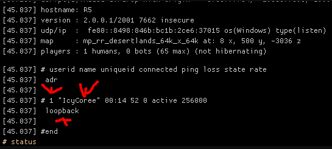

# Status Command

## Status ConCommand

You can get the current server status by doing the following:

```text
status
```



Above you can see the output of the status command.

The most important part it gives back is the name, userid and ipaddress of all clients connected to the server.

In this example the arrow pointing to '1' is the userid for the client, "IcyCoree" the name of the client, loopback the clients ipaddress.


Loopback will show for the client hosting the server.

For every other client it will show and ipaddress there instead.


