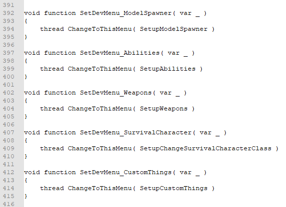

# Custom Dev Menu Tab \(UNSAFE\)


We do **NOT** encourage hosting servers in Dev mode. It introduces unnecessary security risks!


1: you start by going into `\platform\scripts\vscripts\ai\sh_dev_npc_settings.gnut`and adds in the top a new global function `Type global function <Setup<something>` \(Example: global function SetupCustomThings\)


  
2: you then go down in the bottom and adds a new void function `Type "void function Setup<something>()"` \(Example: void function SetupCustomThings\(\)\)

3: under the void function do you type:

```text
{
    #if UI

    SetupDevCommand( "<Name you want to have displayed>", "give <name on the .txt file>" )

    #endif
}
```

4: then you gotta go to `\platform\scripts\vscripts\ui\menu_dev.nut` and under line 271 can you type your new menu up \(place it in the code = where in line you want it to be in the dev menu\)

5: then you have found where you want the menu to be then type `SetupDevMenu( "<Name of the new dev menu>", SetDevMenu_<what you typed after "Setup" in your global and void function> )` \(Example: SetupDevMenu\( "Custom Community Things", SetDevMenu\_CustomThings \)\)


6: then go down under line 392 and add a new void function:

```text
void function SetDevMenu_<what you typed after "Setup" in your global and void function>( var _ )
{
    thread ChangeToThisMenu( Setup<what you typed after "Setup" in your global and void function> )
}
```



